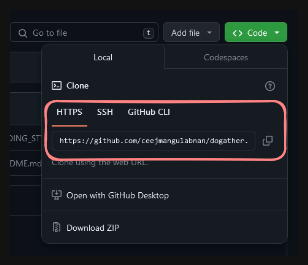
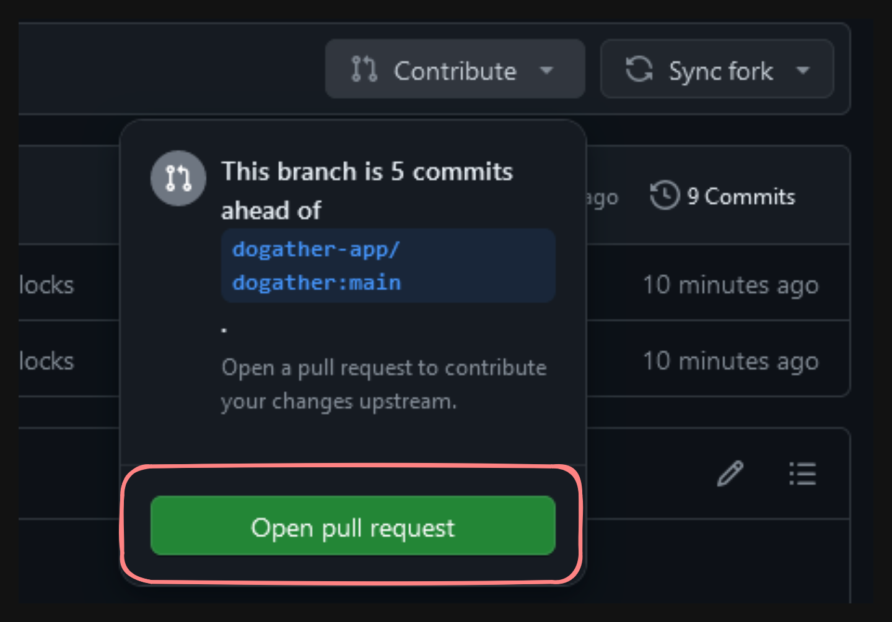

# dogather

# How to Contribute
First, make sure you have git installed on your system.

If you don't have git, then [install it](https://git-scm.com/downloads).

Familiarize yourself with the basics of git, then follow the guide below.

## Create a fork
First, create a fork of this repository by clicking the fork button.

No need to change anything, just continue and create the fork.


## Clone the fork
Go into your forked repository.

Copy the url from your fork in order to clone it to your machine.



```bash
git clone <url-you-copied>
```

## Create a branch
To create a branch go into the repository directory.

```bash
cd dogather
```

Then create a branch with:
```bash
git switch -c <your-branch-name>
```

For example:
```bash
git switch -c add-form-validation
```

## Commit your changes
Then you add the files you want to stage for a commit by doing:
```bash
git add filename
```


Or if you want to add everything:
```bash
git add .
```

Commit the changes with:
```bash
git commit -m 'commit message'
```

Replace `commit message` with a short description of what you changed.

## Push your changes
Once you have committed the changes, you must then push the branch with `git push`.
```bash
git push -u origin your-branch-name
```
Then navigate to your repository on `Github`.

Open a `pull request` by clicking on the `Contribute` button then `Open pull request`.

Your pull request will then be reviewed, and if it's good, it will be merged and closed.


