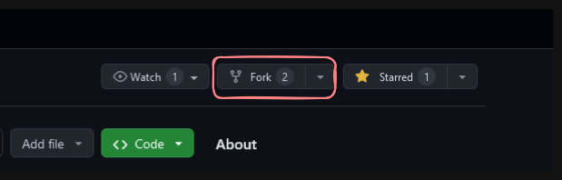

# dogather

# How to Contribute
First, make sure you have `Git` installed on your system
Install `git` [here](https://git-scm.com/downloads) and set it up on your machine.

First create a fork of the repository.

Then copy the url from your fork in order to clone it to your machine.

`git clone <url-you-copied>`
